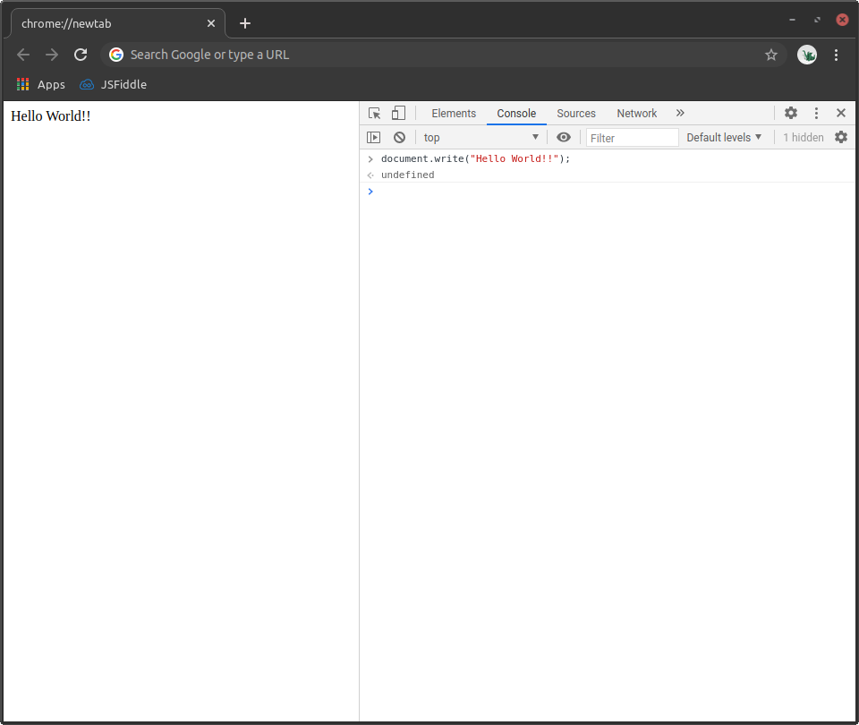

The language of the web. A must-have tool for any web developer. JavaScript.

On the one hand, I am excited to be learning this language. It makes magic happen on the web, and it is always interesting to explore another language model with its syntax and semantics. On the other hand, it is a bit frustrating because I have yet to master the other four languages that I have been introduced to. The more time I spend learning a new language, the less time I can spend on mastering the others. Thus, the life of the amateur technologist. I will just plan accordingly.



JavaScript is the language of the web! What language allows you to write code directly into a web browser? Anyone can open a modern web browser and begin programming JavaScript; I find that to be absolutely amazing! This bypasses that sometimes very annoying process of downloading and configuration of software needed just to print a simple “Hello World” in any other language that I’ve worked with. JavaScript has a sort of open-door policy to the world. If you have access to a web browser, you have access to JavaScript. You just need to learn the language mechanics.
<br><br>
While exploring the language of JavaScript, I often find myself comparing it to the other languages that I am familiar with. Two examples of this are the triple equality, `===`, and the <em>object</em> data structure,

```
let object = {
    key1: value,
    key2: value,
    key3: value
};
```

The triple equality is also used in PHP and for the same purpose - to check the equality of types as well as values. The <em>object</em> data structure reminds me of the <em>structure</em> data sctructure from the C language. The main difference that I've noticed so far is that in JavaScript the syntax is simpler. For example, let's say that I want to make a data structure that represent a point in the 2d-space. If I use a JavaScript object, then it might look like this

```
let p1 = {
    x: 5,
    y: 12
};
```

but I could also use a C structure like so

```
struct point {
    int x = 5;
    int y = 12;
} p2;
```
The syntax used to access the values in each data structure is a little bit different as well. We have
```
p1[x] // returns 5 for the JavaScript object

p2.x // returns 5 for the C structure
```
I'm sure that I will pick up on many more things as I continue to learn this new language. In general, I <em>am</em> glad to be learning JavaScript as I know that I will get a lot of practical use from it. I just need to make sure that I set some time aside to keep practicing the other languages that I have learned thus far.
<br><br>
