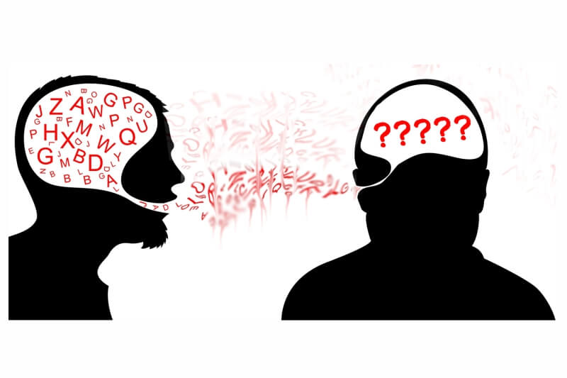

Take a look at these two  snippets of `C` code:

#### Code Snippet A

> int main(int argc, char *argv[ ]) { 
> int a, b; 
> b = 0; 
> while (( a = getchar( ) ) != EOF ) { 
> if ( a == '&nbsp;&nbsp;&nbsp;' || a == '\n' || a == '\t' ) { 
> if ( ++b <= 1 ) putchar( '\n' ); 
> } else { b = 0; putchar(a); } 
> } return 0; 
> }

 

#### Code Snippet B

> // &nbsp; Prints input one word per line. 
> 
> int main (int argc, char *argv[ ]) 
> { 
> &nbsp;&nbsp;&nbsp;&nbsp; int input, escapes; 
> &nbsp;&nbsp;&nbsp;&nbsp; escapes = 0; 
>  
> &nbsp;&nbsp;&nbsp;&nbsp; // Reads input, 1 char at a time, until end-of-file is reached 
> &nbsp;&nbsp;&nbsp;&nbsp; while (( input = getchar( ) ) != EOF ) 
> &nbsp;&nbsp;&nbsp;&nbsp; { 
> &nbsp;&nbsp;&nbsp;&nbsp; &nbsp;&nbsp;&nbsp;&nbsp; // Check if input is a space, newline, or tab  
> &nbsp;&nbsp;&nbsp;&nbsp; &nbsp;&nbsp;&nbsp;&nbsp; if ( input == '&nbsp;&nbsp;&nbsp;' || input == '\n' || input == '\t' ) 
> &nbsp;&nbsp;&nbsp;&nbsp; &nbsp;&nbsp;&nbsp;&nbsp; { 
> &nbsp;&nbsp;&nbsp;&nbsp; &nbsp;&nbsp;&nbsp;&nbsp; &nbsp;&nbsp;&nbsp;&nbsp; // print a newline if less than 2 of space, newline, tab have been read 
> &nbsp;&nbsp;&nbsp;&nbsp; &nbsp;&nbsp;&nbsp;&nbsp; &nbsp;&nbsp;&nbsp;&nbsp; if ( ++escapes <= 1 ) 
> &nbsp;&nbsp;&nbsp;&nbsp; &nbsp;&nbsp;&nbsp;&nbsp; &nbsp;&nbsp;&nbsp;&nbsp; &nbsp;&nbsp;&nbsp;&nbsp; putchar ( '\n' ); 
> &nbsp;&nbsp;&nbsp;&nbsp; &nbsp;&nbsp;&nbsp;&nbsp; } 
> &nbsp;&nbsp;&nbsp;&nbsp; &nbsp;&nbsp;&nbsp;&nbsp; // Reset the escapes counter and print the input  
> &nbsp;&nbsp;&nbsp;&nbsp; &nbsp;&nbsp;&nbsp;&nbsp; else 
> &nbsp;&nbsp;&nbsp;&nbsp; &nbsp;&nbsp;&nbsp;&nbsp; { 
> &nbsp;&nbsp;&nbsp;&nbsp; &nbsp;&nbsp;&nbsp;&nbsp; &nbsp;&nbsp;&nbsp;&nbsp; escapes = 0; 
> &nbsp;&nbsp;&nbsp;&nbsp; &nbsp;&nbsp;&nbsp;&nbsp; &nbsp;&nbsp;&nbsp;&nbsp; putchar ( input ); 
> &nbsp;&nbsp;&nbsp;&nbsp; &nbsp;&nbsp;&nbsp;&nbsp; } 
> &nbsp;&nbsp;&nbsp;&nbsp; } 
> &nbsp;&nbsp;&nbsp;&nbsp; return 0; 
> }

When ran, both snippets of code will do the exact same thing - read input one char at a time and print one word per line. 
Snippet A is implemented in only 9 lines of code, while Snippet B is implemented in more than double the lines of Snippet A.
If both snippets do the same thing, then is there any significant difference between the two?
The significant difference is that Snippet A is just written to work, but Snippet B is written to work and also to communicate.

When we write code, yes we are creating specific instructions for the computer to carry out a certain task, but many times, 
we also expect that other humans will read this code (even our future selves). In the presences of this expectation, code 
becomes more than just instructions to a machine, it becomes a document which communicates the computer instructions to other 
humans. In the code above, Snippet B is a document that communicates to the human being as well as provides instructions to 
the machine. Coding standards help us achieve the objective of communication.

Clearly Snippet B is following some type of coding standard. There is a specific placement of curly brackets, consistent
indentation, frequent use of comments, meaningful variable names, etc... These characteristics make this code easier to 
understand by more people. Take another look at both snippets of code. Which one requires less thinking to understand its
meaning? I bet 10 marbles that most people will choose Snippet B!

Outside the programming world, coding styles exist and serve the same purpose of efficient communication to other humans.
A great example of this is in our very own English language. I'm sure you have heard of the APA, MLA, and Chicago writing
styles for English. These writing styles provide explicit instructions on the use of punctuation, spacing, the use of capital
letters, and so on. By strictly following one of these English <em>coding standards</em>, the writer hopes to maximize meaning
and minimize ambiguity.

As does the English writer using the APA style when writing a paper, so should we, as coders, strive for maximum meaning 
and minimum ambiguity in our code. Let's view our code as documents of communication. Then knowledge can be passed from 
human to human with fewer constraints. This is easily done by following a respected coding style.

    