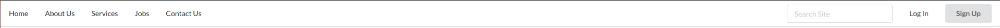
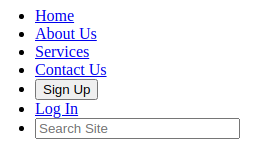
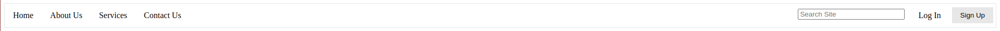

For the past week, I have been exploring a user interface framework called [Semantic UI](https://semantic-ui.com/). With
the experience and knowledge that I have gained so far, I feel comfortable implementing a simple and aesthetically pleasing 
webpage using fewer lines of code than what I may have used had I only coded in raw HTML and CSS. Not only is there a 
reduction in code, but there is also a reduction in thought. That's right...thought. Implementing a simple 
website using Semantic UI requires less thought than doing the same in raw HTML and CSS. We will see an example of these
two benefits by exploring my favorite Semantic UI feature - menus. 

Let's make a simple yet good-looking menu bar. The left side of the menu bar will have five items - <em>Home, About Us, 
Services, Jobs,</em> and <em>Contact Us</em>. These seem like basic options that a standard website would have. Now for the right
side, we will put a standard search bar, a <em>Log In</em> option, and a <em>Sign up</em> option. These are also pretty 
standard features of many websites. Implementing these features using Semantic UI, is fairly simple and requires zero css.

First, we know that we are making a menu, so we can use the `ui borderless menu` class.

```angular2html
<div class="ui borderless menu">
    <!-- insert code here -->
</div>
```

Next, we want the five items to display on the left of the menu bar. For each item, we use the class `item`. Displaying 
to the left is the default behavior, so all that we need to do is to include the items in the newly created `div`.

```angular2html
<div class="ui borderless menu">
    <!-- left side of menu bar -->
    <a class="item">Home</a>
    <a class="item">About Us</a>
    <a class="item">Services</a>
    <a class="item">Jobs</a>
    <a class="item">Contact Us</a>
</div>
```

The left side is finished. For the right side, first we can make the search bar. Since it will be an item on the right side,
we will use the class `right item`.

```angular2html
<div class="ui borderless menu">
    <!-- left side of menu bar -->
    <a class="item">Home</a>
    <a class="item">About Us</a>
    <a class="item">Services</a>
    <a class="item">Jobs</a>
    <a class="item">Contact Us</a>
    
    <!-- right side of menu bar -->
    <div class="right item">
        <!-- search bar code -->
    </div>
</div>
```

To include the search bar, we use the class `ui icon input`.

```angular2html
<div class="ui borderless menu">
    <!-- left side of menu bar -->
    <a class="item">Home</a>
    <a class="item">About Us</a>
    <a class="item">Services</a>
    <a class="item">Jobs</a>
    <a class="item">Contact Us</a>
    
    <!-- right side of menu bar -->
    
    <div class="right item">
        <div class="ui icon input">
            <!-- search bar -->
            <input type="text" placeholder="Search Site">
        </div>
    </div>
    
</div>
```

We just have two item left! This is just four more lines of code!

```angular2html
<div class="ui borderless menu">
    <!-- left side of menu bar -->
    <a class="item">Home</a>
    <a class="item">About Us</a>
    <a class="item">Services</a>
    <a class="item">Jobs</a>
    <a class="item">Contact Us</a>
    
    <!-- right side of menu bar -->
    
    <div class="right item">
        <div class="ui icon input">
            <!-- search bar -->
            <input type="text" placeholder="Search Site">
        </div>
    </div>

    <a class="item">Log In</a>
    
    <div class="item">
        <button class="ui button">Sign Up</button>
    </div>
</div>
```

And this is what we get.<br>



We get a nice looking and simple menu bar, and we didn't even have to think much about formatting. All of this was
implemented using just 16 lines of code! Now let's try to do a similar thing using html and css. We will not go 
step-by-step with <em>this</em> implementation. That would take far too long!

Here is the html code for our menu.

```angular2html
<ul>
    <!-- left side of menu bar -->
    <div class="leftMenu">
        <li><a class="active" href="#">Home</a></li>
        <li><a href="#">About Us</a></li>
        <li><a href="#">Services</a></li>
        <li><a href="#">Contact Us</a></li>
    </div>

    <!-- right side of menu bar -->
    <div class="rightMenu">
        <li><button>Sign Up</button></li>
        <li><a href="#">Log In</a></li>
        
        <!-- search bar -->
        <li><input type="text" placeholder="Search Site"></li>
    </div>
</ul>
```

This looks pretty simple enough. There's even less code than our Semantic UI menu example. Let's see what this gives us.



Yikes. That looks pretty terrible. To make it look halfway decent, we'll add the following css.

```
ul {
    list-style-type: none;
    margin: 0;
    padding: 0;
    overflow: hidden;
    border: 1px solid #e7e7e7;
}

.leftMenu li {
    float: left;
}

.leftMenu li a {
    display: block;
    color: black;
    text-align: center;
    padding: 14px 16px;
    text-decoration: none;
}

li a:hover:not(.active) {
    background-color: #ddd;
}

.rightMenu li {
    float: right;
}

.rightMenu li a {
    display: block;
    color: black;
    text-align: center;
    padding: 14px 16px;
    text-decoration: none;
}

.rightMenu li input {
    margin: 10px;
}

button {
    background-color: #e7e7e7;
    border: none;
    padding: 8px 16px;
    text-align: center;
    text-decoration: none;
    margin: 7px 5px;
    cursor: pointer;
}
```

Jeez! That's a lot! Let's see what this gets us.<br>



Well that looks okay, I suppose, but the Semantic UI menu bar takes much less effort and code to implement.

My experience with Semantic UI is my first exposure to a user interface framework. So far, I find it to be incredibly
useful and time-saving. As we've just seen with the menu bar example, creating a simple and good-looking user interface 
is quite easy with Semantic UI. I am looking forward to learning much more!