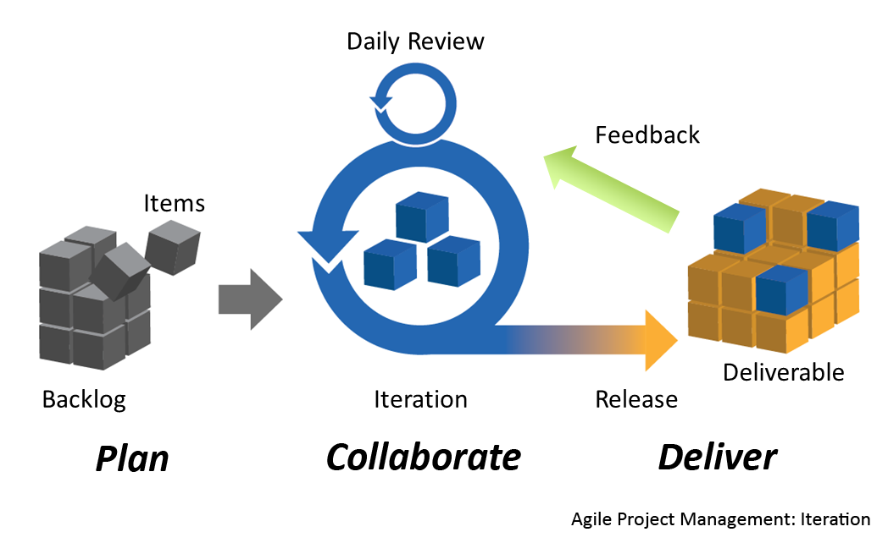
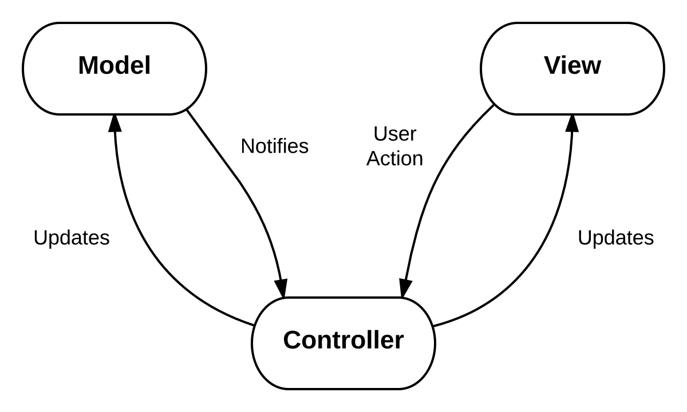

These past 5 months have been quite the software engineering learning experience. I have acquired a lot of new and very
useful skills. I received a whirlwind introduction to [JavaScript](https://developer.mozilla.org/en-US/docs/Web/javascript),
I was introduced to [web application frameworks](https://en.wikipedia.org/wiki/Web_framework) such as [Semantic-UI-React](https://react.semantic-ui.com/)
and [Meteor](https://guide.meteor.com/), and I received an introduction to many other useful topics.  Two topics that
stand out the most to me are Agile Project Management and Design Patterns. Let’s first discuss Agile.

Agile is a project management practice. Its focus is to create a fully functioning product in a short amount of time,
then to iteratively build upon the product. The [twelve principles](https://agilemanifesto.org/principles.html) of the
Agile practice, as documented in the [Agile Manifesto](https://agilemanifesto.org/), are:

1. Our highest priority is to satisfy the customer through early and continuous delivery of valuable software.
2. Welcome changing requirements, even late in development. Agile processes harness change for the customer's
   competitive advantage.
3. Deliver working software frequently, from a couple of weeks to a couple of months, with a preference to the shorter
   timescale.
4. Business people and developers must work together daily throughout the project.
5. Build projects around motivated individuals. Give them the environment and support they need, and trust them to get
   the job done.
6. The most efficient and effective method of conveying information to and within a development team is face-to-face
   conversation.
7. Working software is the primary measure of progress.
8. Agile processes promote sustainable development. The sponsors, developers, and users should be able to maintain a
   constant pace indefinitely.
9. Continuous attention to technical excellence and good design enhances agility.
10. Simplicity--the art of maximizing the amount of work not done--is essential.
11. The best architectures, requirements, and designs emerge from self-organizing teams.
12. At regular intervals, the team reflects on how to become more effective, then tunes and adjusts its behavior
    accordingly.
    
I learned a project management style, derived from the Agile practice, called [Issue Driven Project Management (IDPM)](https://www.youtube.com/watch?v=13OFmXw47P4&t=453s).
The rules for using IDPM are as follows:

1. Divide up the work into tasks.
2. No task takes longer than 3 days.
3. Each task is specified by an Issue.
4. Each Issue has a single owner.
5. Issues are organized into Milestones.
6. Milestones have due dates.
7. Milestones are represented by Project Boards.
8. At all times, every person has at least 1 Issue that they are responsible for closing.

As an environment to execute IDPM, I learned to use [GitHub’s project management software](https://github.com/features/project-management).
Though I used IDPM to develop web applications, the principles can easily be used for other types of applications. For
example, I would like to create a program that, when fed another program (or a directory of programs) will generate a
document (PDF and/or HTML) that describes each function and class of the input program(s). Using the principles of IDPM,
I would split the project into Milestones. For each Milestone, I would split up the project into Issues. I would only
focus on one Milestone at a time. If anyone else joins the project, they can be assigned specific issues. We would have
a working product within weeks, but we would continue to improve the product indefinitely.

Now, to the topic of Design Patterns, I cannot overstate enough how pleased I am to have been introduced to this topic!
In general, a Design Pattern is a [“reusable solution to a commonly occurring problem within a given context in software design."](https://en.wikipedia.org/wiki/Software_design_pattern) 
I learned to use Design Patterns to organize the source code of a software project in a purposeful and logical way.  

In the past, when I (and a team) would work on a software project, the organization of the source code was not planned;
it was instead improvised by each developer. Each individual would eventually develop their own style and logic of
organizing the source code. The end product would be messy and unorganized code – difficult to debug and maintain. From
now on, any project that I work on must intentionally use a design pattern, even if I am the only one working on the
project.

[Model-View-Controller (MVC)](https://en.wikipedia.org/wiki/Model%E2%80%93view%E2%80%93controller), is an excellent
example of a design pattern that I plan to use for future projects. In the MVC design pattern, the source code is
separated into three natural components – the Model, the View, and the Controller.

• The Model is for the source code used to access and manipulate the data needed for the software. 

• The View is for the source code used to create the user interface of the software. 

• The Controller is for the sources code that manages the interactions between the View, Model, and the user. 

As an example, notice that I can use the MVC design pattern to create the document generator software (mentioned
previously). To represent the View, I can create a directory called View. In this directory there will be files and
sub-directories that contain source code for displaying the user interface for the user to interact with the software.
The interface would provide a means for the user to upload files and directories. To represent the Model, I can create a
directory called Model, and store in it only program files that contain the source code for accessing and manipulating
the programs fed to the document generator software. Finally, to represent the Controller, I can create a directory
called Controller, and store in it only files and directories that contain the source code for controller functions.
There would be source code for taking the file that the user uploaded (using View code), manipulate the file’s data
(using Model code), and then displaying the results of the manipulation to the user (using View code).

I still have much to practice and learn about Agile, IDPM, Design Patterns, and software development as a whole.
My journey has only just begun, and I hope that it never ends.
 
 
 
 
 
 