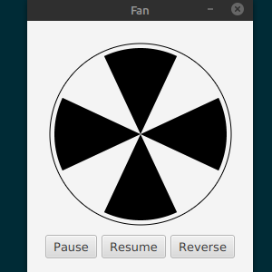

Running Fan is a simumlation of a fan. The user has 3 options - Pause, Resume, and Reverse. Pressing the Resume buttom will cause the fan to animate; the blades will spin non-stop. The Reverse button will reverse the direction of the spinning blades. The Pause button will cause the blades to stop spinning.

I created this program to explore the tools that [JavaFX](https://openjfx.io/) has available for creating animation. Two notable JavaFX classes that I used are [KeyFrame](https://docs.oracle.com/javase/8/javafx/api/javafx/animation/KeyFrame.html) and [Timeline](https://docs.oracle.com/javase/8/javafx/api/javafx/animation/Timeline.html). Used together, creating an animation using JavaFX becomes quite simple.

You can view the code on [GitHub](https://github.com/markyoung010/fan).

