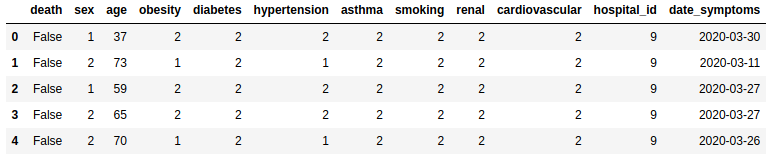
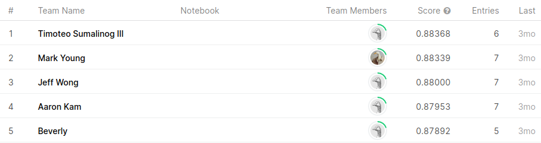

In this project, I used machine learning to predict the probability of whether a COVID-19 patient will die.  The data
that I used was provided by the Mexican government, but I retrieved the data from this [Kaggle competition](https://www.kaggle.com/c/covid19-risk-mexico/data).

The picture below shows the first five rows of the data that I used to train a [decision tree](https://en.wikipedia.org/wiki/Decision_tree_learning)
classifier. Each row represents one patient.

The IDE that I used for this project is [Jupyter Notebooks](https://jupyter.org/), and the programming language used is
[Python](https://www.python.org/).

Through this project, I learned to use the some of the many tools that Python has for doing data analysis and machine
learning, such as [numpy](https://numpy.org/), [pandas](https://pandas.pydata.org/pandas-docs/stable/index.html), and
[scikit-learn](https://scikit-learn.org/stable/index.html). I also received the chance to explore the decision tree
modeling approach to classify data.

A fun thing about this project is that I also used it as part of a Kaggle competition. I submitted my predictions to the
competition, my submission was then graded, then finally I was ranked in comparison to other competitors. Out of the 28
people that participated, I made it to the second place spot.

You can view the code on [GitHub](https://github.com/markyoung010/Mexico-COVID19-Patients)
 
 
 
 
 
 