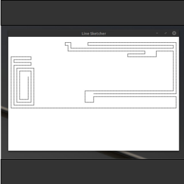

Line Sketcher is very similar to an echasketch, but instead of being a toy, it's a desktop application. To play the game, all the user has to do is move the arrow keys. A line will extend in the direction indicated by the pressed arrow key.

I created Line Sketcher using Java and [JavaFX](https://openjfx.io/). JavaFX has lots of great tools for making desktop and mobile applications. This project helped me to strengthen my knowlegde and skills of the tools available in JavaFX. 
 
You can view the code on [GitHub](https://github.com/markyoung010/line_sketcher).
