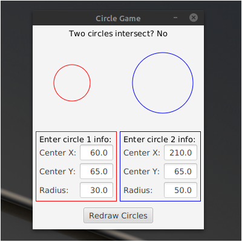

Circle Game is a desktop application that I made to explore user interface development. The programming language used is Java. The tools that I used to create the UI are from JavaFX.

There is no real objective to the game. The player must use the interface to move the circles and change their radii. If the circles intersect, the game prints 'Yes'. 

You can view the code on [GitHub](https://github.com/markyoung010/circle_game).

