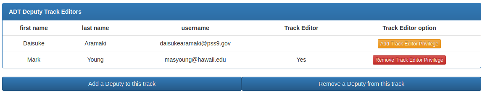

For this project, me and another developer were tasked with the job of making major modifications to the
[Conference Review Manager (CRM)](https://www.conferencereviewmanager.com/) software. The modifications were made at the
request of the [Construction Research Congress 2022 (CRC 2022)](https://cisummit-crc.asce.org/) administrative team, and
funded by the [American Society of Civil Engineers (ASCE)](https://www.asce.org/).

CRM is a web application used to manage the paper submission and review process of academic research conferences. In
the software, users are given the roles of Authors, Reviewers, Editors, Administrators, Copy Editors, and some other
roles. The general flow of the process is

   1. The Author will upload an abstract for submission.
   2. The Editor will assign Reviewers to peer-review the abstract.
   3. The Reviewers will submit their decisions on the abstract.
   4. The Editor decides if the abstract is accepted.
   5. If the abstract is accepted, the Reviewer will upload a manuscript for submission.
   6. The Editor will assign Reviewers to peer-review the manuscript.
   7. The Reviewers will submit their final decision on the manuscript.
   8. The Editor decides if the manuscript is accepted.
   9. If accepted, the manuscript is sent to the Copy Editors.
   10.  etc…

The administrative team for the CRC 2022 conference decided to use the CRM software. They had already completed the
abstract submission and review process. Before they began the manuscript submission and review process, they requested
some modifications to the software. These modifications include:

   1. Create an option for the Administrators to view the manuscripts, and the manuscript review statistic for an
      indicated track (i.e. ADT – Advanced Technologies and Data Analytics, CED – Construction Education, etc...)
   2. Add the Track Editor and Deputy Track Editor user roles to the software.
   3. Create an option for the Administrators to be able to give any user the Track Editor and/or Deputy Track Editor
      privileges (see picture).
   4. Create an Option for the Administrators to assign the Track Editors and Deputy Track Editors to a specific track
      (ADT, CED, etc...).
   5. Create the ability for Track Editors to manage and view the work of the Deputy Editors in their track.
   6. Create options for the Track Editor to assign manuscripts to the Deputy Editors in their track.
   7. Create the ability for Deputy Editors to assign reviewers to the manuscripts that they are assigned.

I was responsible for tasks 1, 3, 4, and 5. To manage the project, we used a Google spreadsheet, and a project management
method enforced by my manager. The project management style seemed to be the
[Waterfall model](https://en.wikipedia.org/wiki/Waterfall_model), as it was broken down into linear sequential phases,
and the customer (CRC 2022 Admin team) only saw the product after it was fully completed.

To finish the project, I made heavy use of the [PHP programming language](https://www.php.net/). The data for the
software was stored in a [MySQL database](https://www.mysql.com/), so I had to create code to read, write, and modify
the database.

Some awesome takeaways from this project is that I learned a lot about the capabilities of PHP, how to use
[cPanel](https://www.cpanel.net/) to deploy a web application from a [GitHub](https://github.com/) repository, and I was
able to get a lot of practice with branching and merging a GitHub repository.

I cannot provide a link to the source code because I do not own the rights. The rights are owned by the
[International Structural Engineering and Construction Society](https://www.isec-society.org/).
 
 
 
 
 
 