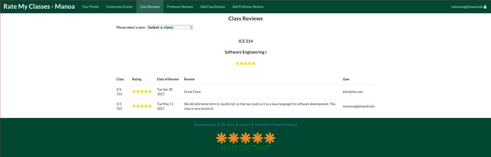

For this project, I worked in a team of four developers to create a web application called
[Rate My Classes Manoa](https://rate-my-classes-manoa.github.io/). Rate My Classes Manoa allows students of the
[University of Hawaii at Manoa (UH Manoa)](https://manoa.hawaii.edu/) to create a profile, rate UH Manoa classes,
and also rate UH Manoa Professors. We used [GitHub’s project management](https://github.com/features/project-management)
software to manage the project, along with the management principles of
[Issue Driven Project Management (IDPM)](https://www.youtube.com/watch?v=13OFmXw47P4&t=2s).

My responsibilities in the project included:

   1. Create a utility for the Administrator to add a class to the database.
   2. Create a utility for the Administrator to add a professor to the database.
   3. Integrating the Class Review page with the database, so that it reads from the database in order to display data
      to the screen (see picture).
   4. Create a "Meet the Dev Team" page, and a "Careers" page.

The main programming language used was [JavaScript](https://developer.mozilla.org/en-US/docs/Web/javascript). The data
for the software was stored in a [mongoDB](https://www.mongodb.com/1) database. As a base template for the application,
we used [meteor-application-template-react](https://ics-software-engineering.github.io/meteor-application-template-react/).

The two main skills that I have gained from this project are

   1. A better understanding of how to read, write, and modify data using mongoDB.
   2. Hands-on experience using IDPM with a team.

[Click here to view the GitHub project page for this project](https://github.com/Rate-My-Classes-Manoa).
 
 
 
 
 
 